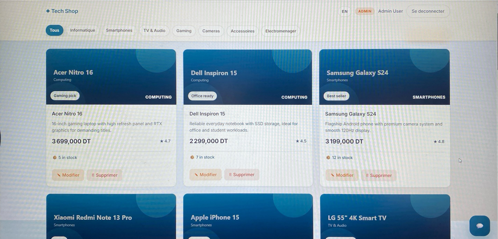
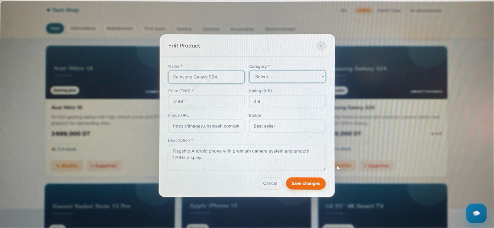
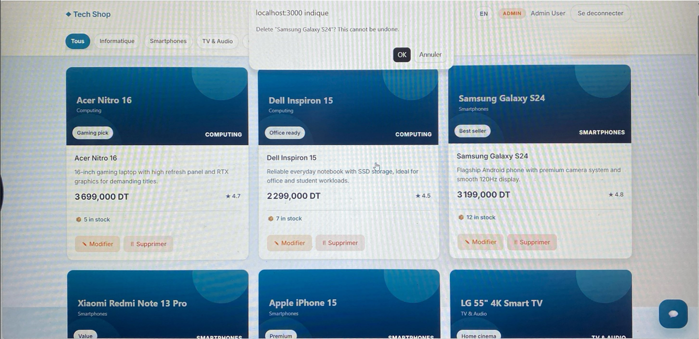
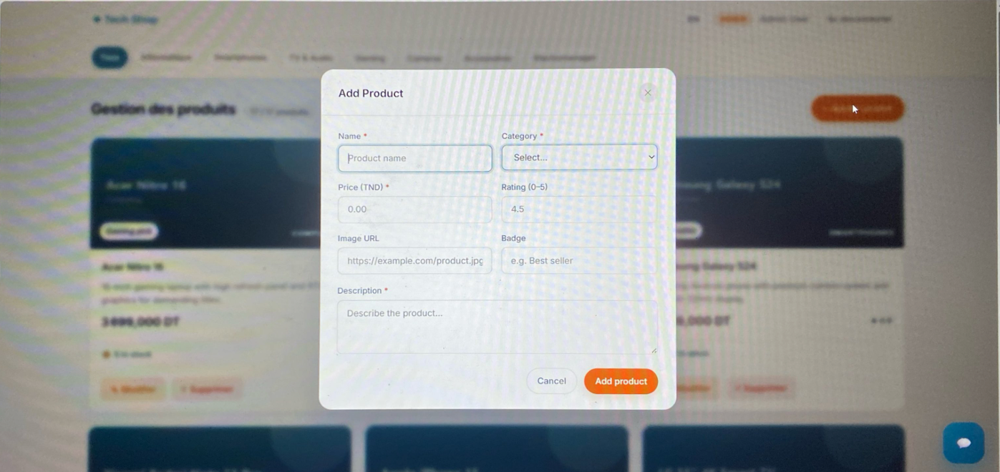
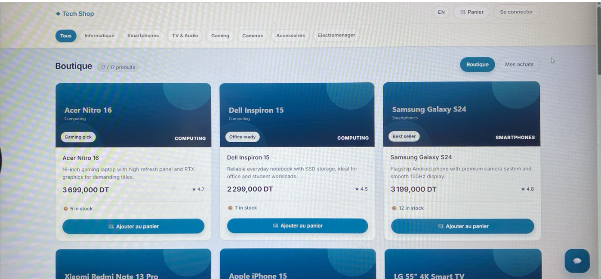
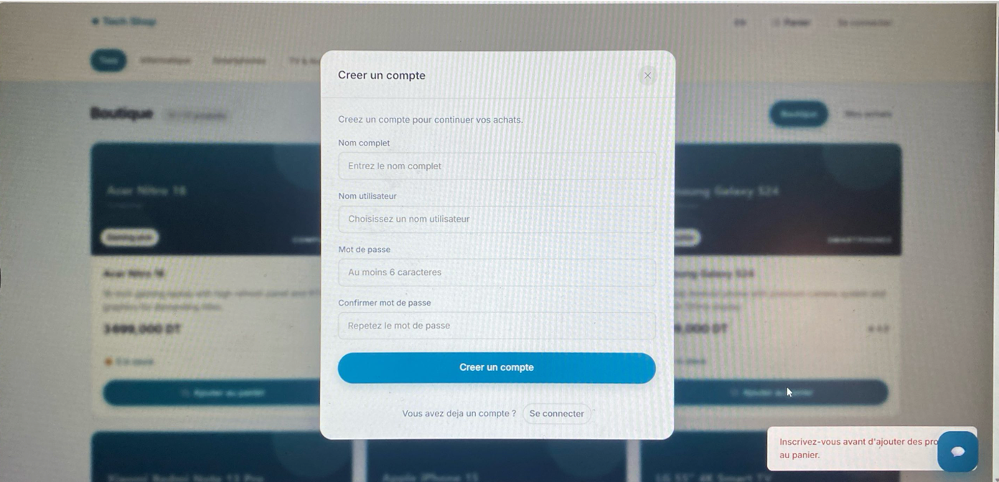
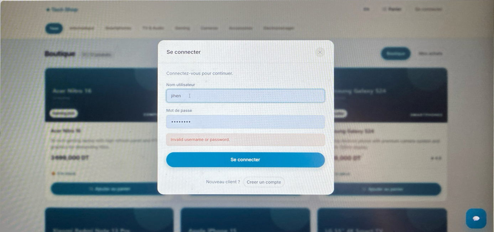
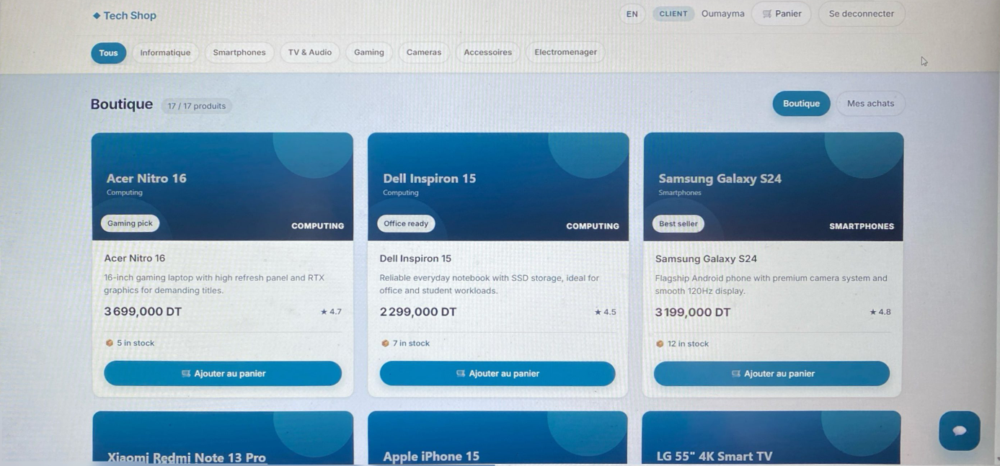
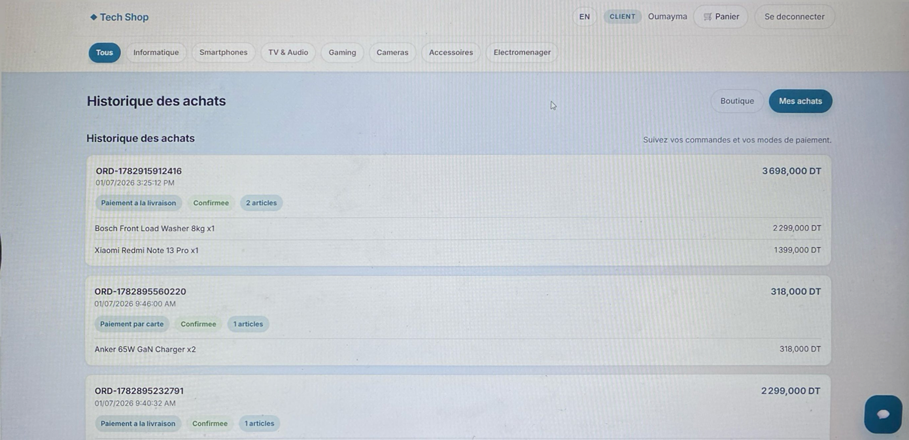

Key Business Features

-Auth:

Client registration only

Single enforced admin account (admin/admin)

-Purchase:

Shopping cart

Checkout process

Stock decrement after purchase

-Client History:

“My Purchases” tab

Complete order details

-Chatbot:

Modern interface

Deterministic mode with optional LLM fallback

-Security and Governance:

Reserved admin username

Admin‑protected endpoint for database backup (secured by admin token)

Server‑side validation for payment and stock operations

//Admin Product Dashboard

Demonstrates product cards with price, rating, stock count, and action buttons Modifier / Supprimer for editing or deleting items.

//Edit Product Form

Includes fields for name, category, price, rating, image URL, badge (“Best seller”), and description.
Shows how an admin can update product details and save changes.

//Delete Confirmation Dialog

Demonstrates the delete‑product workflow with OK / Annuler buttons.

//Add Product Form

Fields for name, category, price, rating, image URL, badge, and description, plus Cancel / Add product buttons.
Illustrates how new items are added to the catalog.

//Client Shop View

Demonstrates the customer‑facing layout and shopping functionality.

//Create Account Page

Fields for full name, username, password, and confirmation.
Includes a prompt to log in if the user already has an account.

//Login Page

Example of an invalid login message (“Invalid username or password”).
Includes link to create a new account.

//Client Dashboard

Shows logged‑in user “Oumayma,” product list, and shopping options.
Confirms successful authentication and personalized session.

//Purchase History

Lists order IDs, dates, payment methods, statuses, and purchased items

